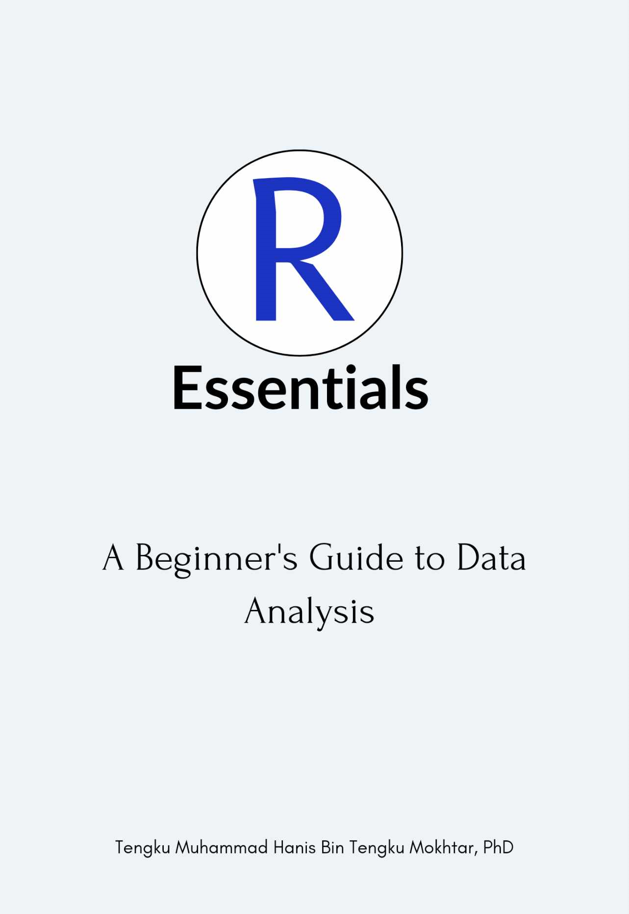

## **Abstract**

{width="26%"}

The book provides essential knowledge for beginners looking to start data analysis with R. Covering foundational concepts such as data exploration, plotting, and descriptive statistics, it is designed to guide readers through the basics, making R more accessible for data analysis tasks. The book is still a work in progress, but an early draft is available for free on [the author's GitHub page](https://tengku-hanis.github.io/r_essential/).
