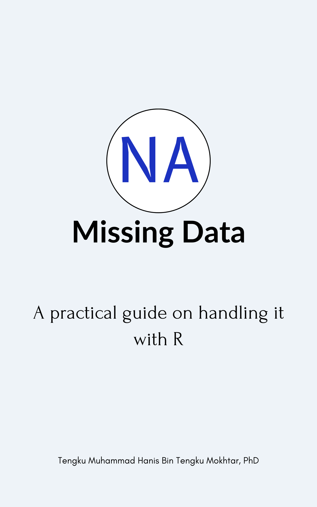

## **Abstract**

{width="40%"}

The book offers practical insights into understanding and managing missing data using R, making it an invaluable resource for data analysts and researchers. It covers key topics such as the types of missing data, possible solutions for handling them, and best practices to ensure robust data analysis. With a clear focus on practical implementation, the book equips readers with the skills needed to address real-world challenges in data analysis. Although still a work in progress, an early draft is available for free on [the author's GitHub page](https://tengku-hanis.github.io/missing_data/).
