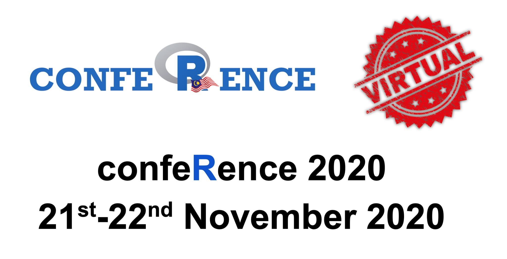

The use of cause-specific survival is overwhelmingly popular. In contrast, the relative survival approach is almost unknown despite some of its advantages over the cause-specific survival. This talk aims to cover an introduction to relative survival, strengths and limitations of both cause-specific and relative survival approaches, and provide a brief demonstration of relative survival analysis in R.

-   Date: Nov 22, 2020 12:45 PM — 1:30 PM
-   Event: Malaysia’s R confeRence 2020
-   Download:
    -   [ Slides](https://tengkuhanis.netlify.app/talks/rconf2020/conference2020#1)
    -   [ Material](https://github.com/tengku-hanis/relative-survival-nov2020)
