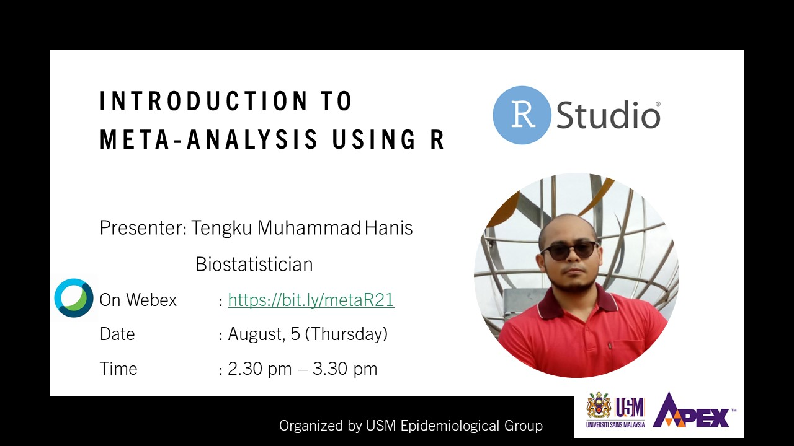

Meta-analysis is a statistical approach that combine the results of the multiple scientific studies into a pooled result. Meta-analysis is widely used in various research areas, including health and medical sciences. This webinar demonstrated a meta-analysis hands-on using R.

-   Date: Aug 5, 2021 2:30 PM — 2:30 PM
-   Location: Virtual
-   Links:
    -   [ Slides](https://github.com/tengku-hanis/webinar-basic-MA/blob/main/MA-webinar-05-08-2021.pdf)
    -   [ Material](https://github.com/tengku-hanis/webinar-basic-MA)
