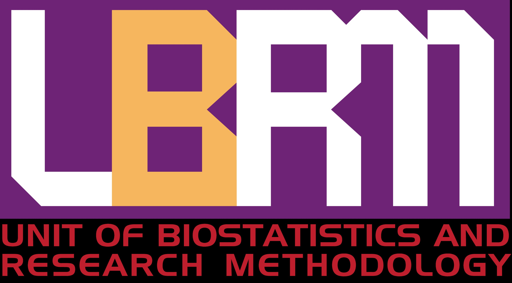

Meta-analysis is a statistical approach that combine the results of the multiple scientific studies into a pooled result. Meta-analysis is widely used in various research areas, including health and medical sciences. This webinar demonstrated a meta-analysis hands-on using R.

-   Date: Aug 18, 2021 9:00 AM — 10:30 AM
-   Location: Virtual
-   Links:
    -   [ Slides](https://github.com/tengku-hanis/basic-MA-biostat/blob/main/Slide-basic-MA.pdf)
    -   [ Material](https://github.com/tengku-hanis/basic-MA-biostat)
