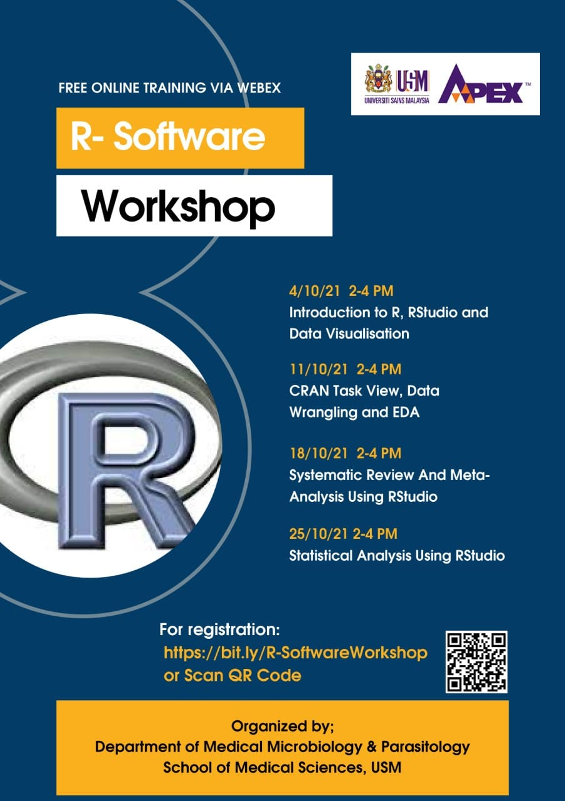

Meta-analysis is a statistical approach that combine the results of the multiple scientific studies into a pooled result. Meta-analysis is widely used in various research areas, including health and medical sciences. This webinar demonstrated a meta-analysis hands-on using R.

-   Date: Oct 18, 2021 2:00 PM — 4:00 PM
-   Location: Virtual
-   Download:
    -   [ Slides](https://github.com/tengku-hanis/MA-PPSP-USM/blob/main/Meta-analysis%20%28Hands-on%29.pdf)
    -   [ Material](https://github.com/tengku-hanis/MA-PPSP-USM)
