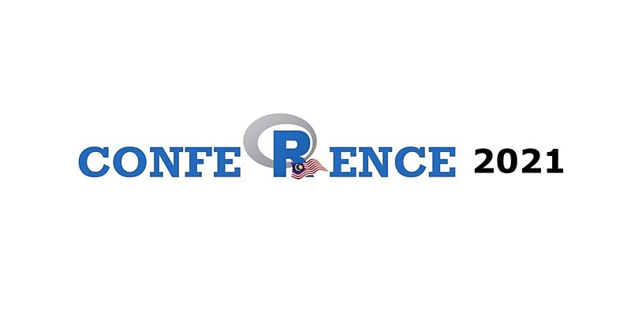

Meta-analysis provides a set of quantitative approaches to summarise previous scientific studies, and draw a meaningful conclusion in regards to the area of study. This talk covered an introduction to a meta-analysis in R, mainly using meta, robvis and dmetar packages. Additionally, this talk included an explanation of a basic framework and jargon in meta-analysis.

-   Date: Nov 6, 2021 2:00 PM — 4:00 PM
-   Event: Malaysia’s R confeRence 2021
-   Download:
    -   [ Slides](https://github.com/tengku-hanis/Rconference2021/blob/main/Rconf2021-meta-analysis.pdf)
    -   [ Material](https://github.com/tengku-hanis/Rconference2021)
