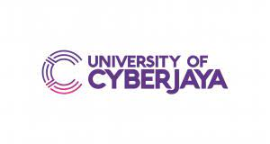

This session covered a systematic review, a topic under Research & Evidence Based Medicine III (REBMI III) subject. This session was attended by 4th year medical students at University of Cyberjaya. This session discussed mainly about the aims and general steps of doing a systematic review.

-   Date: Jan 27, 2022 4:30 PM — 6:30 PM
-   Location: Virtual
-   Download:
    -   [ Slides](https://docs.google.com/presentation/d/e/2PACX-1vQRDj1IdW4W_W8Cj_WhBcAwEpisfJqSr33_83CfSOpdIUx6ZQh5gxTzc3M9XLuEgPhmSX2T4O-z3UDm/pub?start=false&loop=false&delayms=3000&slide=id.p)
