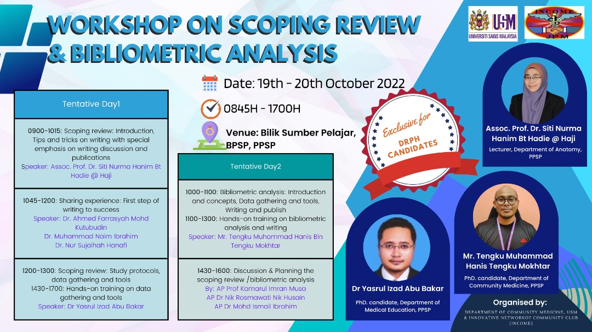

Bibliometric analysis is a quantitative approach in exploring the patterns of publications and literatures in certain research area. This workshop demonstrated a bibliometric analysis using bibliometrix package in R. This workshop was exclusively organised for Doctorate of Public Health (DrPH) candidates in Univerisiti Sains Malaysia.

-   Date: Oct 20, 2022 10:00 AM — 1:00 PM
-   Location: Bilik Sumber Pelajar, BPSP, PPSP, USM
-   Download:
    -   [ Slides](https://docs.google.com/presentation/d/e/2PACX-1vSncBWzmXldPRTwQVs_RtBIMljMT8wqFGQ8oJiZ7EohyVagotaeVp8yBoB3ThKkzijtoXHVaSZcFjoe/pub?start=false&loop=false&delayms=3000&slide=id.p)
    -   [ Material](https://github.com/tengku-hanis/biblio-JPM)
