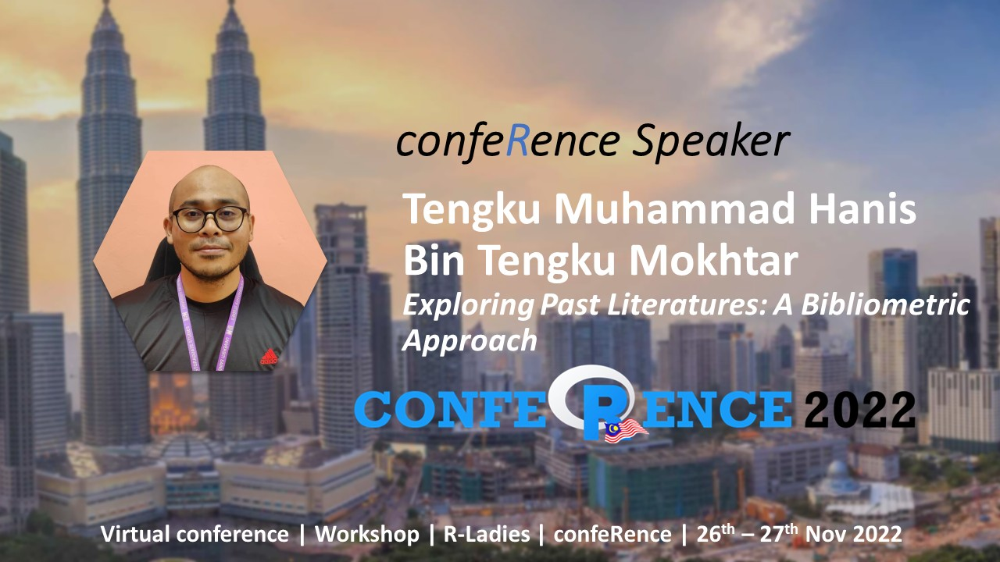

Bibliometric analysis is a quantitative approach in exploring the patterns of publications and literature in a research area. This talk introduced audience to bibliometrics in general and demonstrated the analysis using the bibliometrix package in R.

-   Date: Nov 27, 2022 2:00 PM — 2:50 PM
-   Event: Malaysia’s R confeRence 2022
-   Links:
    -   [ Slides](https://tengku-hanis.github.io/bibliometrics_Nov2022/#1)
    -   [ Material](https://github.com/tengku-hanis/bibliometrics_Nov2022)
