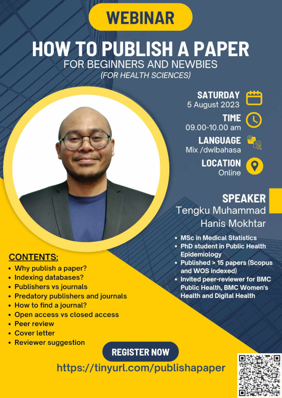

Publishing a scientific paper is one of the way to disseminate the findings of our research. This webinar covered all the necessary information needed to publish a paper for beginners. The slides and recording of the webinar is available for purchase at [Jom Research](https://tinyurl.com/jomresearchlinks?fbclid=IwZXh0bgNhZW0CMTAAAR03m6xQOpINtpXgMU8wRzYSRBEGcP3lgdqG7ez-OlDeac616GEH6nV6iVc_aem_QZWpvfqNmF4dzUD2r0-6PA).

-   Date: Aug 5, 2023 9:00 AM — 10:00 AM
-   Location: Virtual (Google Meet)
