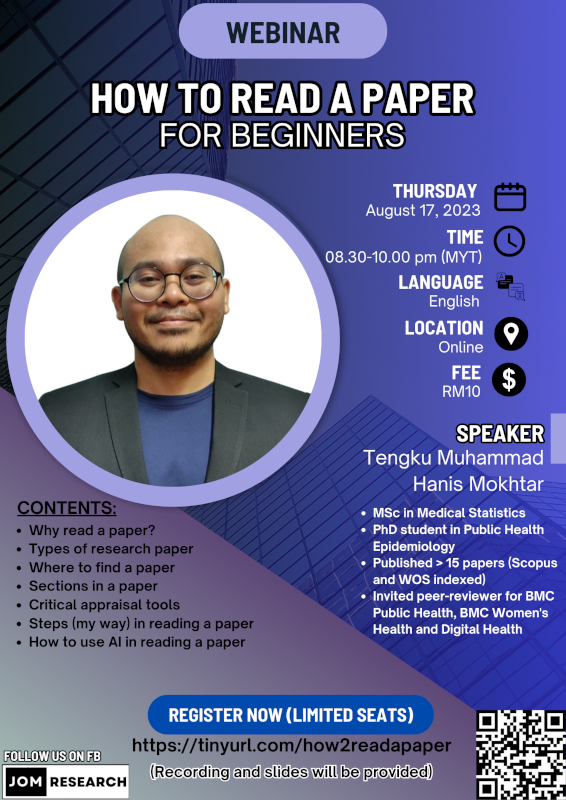

Reading a scientific paper efficiently is one of the necessary skills needed in becoming a good researcher. This webinar covered all the necessary information required to become efficient in reading a scientific paper. This webinar was aimed for the beginners to develop their basic skills to survive in a research world. The slides and recording of the webinar is available for purchase at [Jom Research](https://tinyurl.com/jomresearchlinks?fbclid=IwZXh0bgNhZW0CMTAAAR03m6xQOpINtpXgMU8wRzYSRBEGcP3lgdqG7ez-OlDeac616GEH6nV6iVc_aem_QZWpvfqNmF4dzUD2r0-6PA).

-   Date: Aug 17, 2023 8:30 PM — 10:00 PM
-   Location: Virtual (Google Meet)
