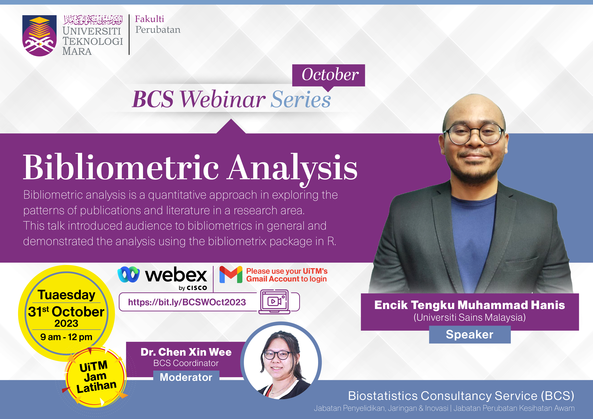

This webinar was organised by Biostatistics Consultancy Service (BSC) summary: This webinar was organised by Biostatistics Consultancy Service (BSC), Fakulti Perubatan, Universiti Teknologi Malaysia. abstract: Bibliometric analysis is a quantitative approach in exploring the patterns of publications and literature in a research area. This talk introduced audience to bibliometrics in general and demonstrated the analysis using the bibliometrix package in R.

-   Date: Oct 31, 2023 9:00 AM — 12:00 PM
-   Location: Virtual (Google Meet)
