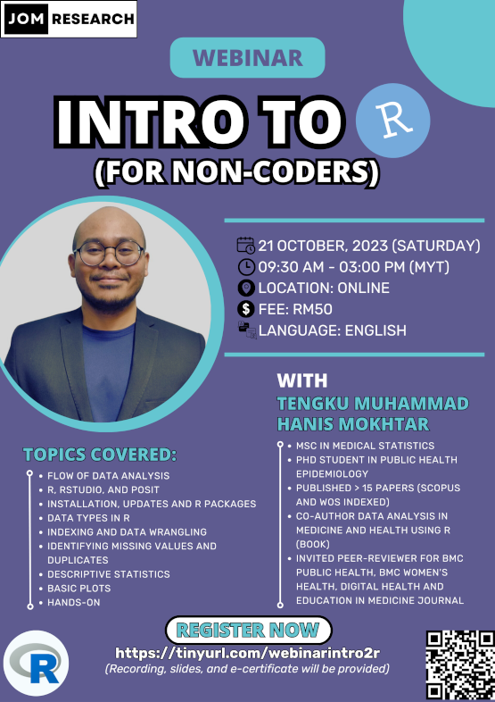

R and RStudio are commonly used in data analysis and statistical modeling. R is a powerful open-source programming language that provides a wide range of statistical and data manipulation tools. RStudio, on the other hand, is a popular integrated development environment (IDE) designed specifically for R, offering a user-friendly interface, code editing, and visualization capabilities, making it an essential tool for data analysts and scientists. This webinar introduced the participants to R and RStudio in a systematic and easy to understand approach especially for those without the programming background. The slides and recording of the webinar is available for purchase at [Jom Research](https://tinyurl.com/jomresearchlinks?fbclid=IwZXh0bgNhZW0CMTAAAR03m6xQOpINtpXgMU8wRzYSRBEGcP3lgdqG7ez-OlDeac616GEH6nV6iVc_aem_QZWpvfqNmF4dzUD2r0-6PA).

-   Date: Oct 21, 2023 9:30 AM — 3:00 PM
-   Location: Virtual (Google Meet)
