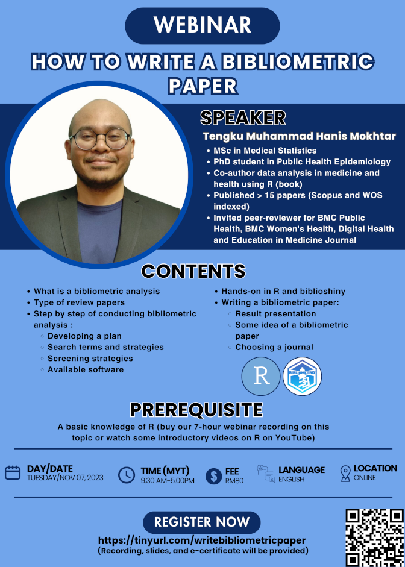

Bibliometric analysis is a quantitative method used to assess and evaluate the impact, influence, and characteristics of academic publications, typically in the form of scientific papers and scholarly articles. It involves the use of statistical and data-driven techniques to analyze citation patterns, co-authorship networks, and other bibliographic data to gain insights into the research output and impact of individuals, institutions, or fields of study. This webinar covered step-by-step how to do a bibliometric paper. The slides and recording of the webinar is available for purchase at [Jom Research](https://tinyurl.com/jomresearchlinks?fbclid=IwZXh0bgNhZW0CMTAAAR03m6xQOpINtpXgMU8wRzYSRBEGcP3lgdqG7ez-OlDeac616GEH6nV6iVc_aem_QZWpvfqNmF4dzUD2r0-6PA).

-   Date: Nov 7, 2023 9:30 AM — 5:00 PM
-   Location: Virtual (Google Meet)
