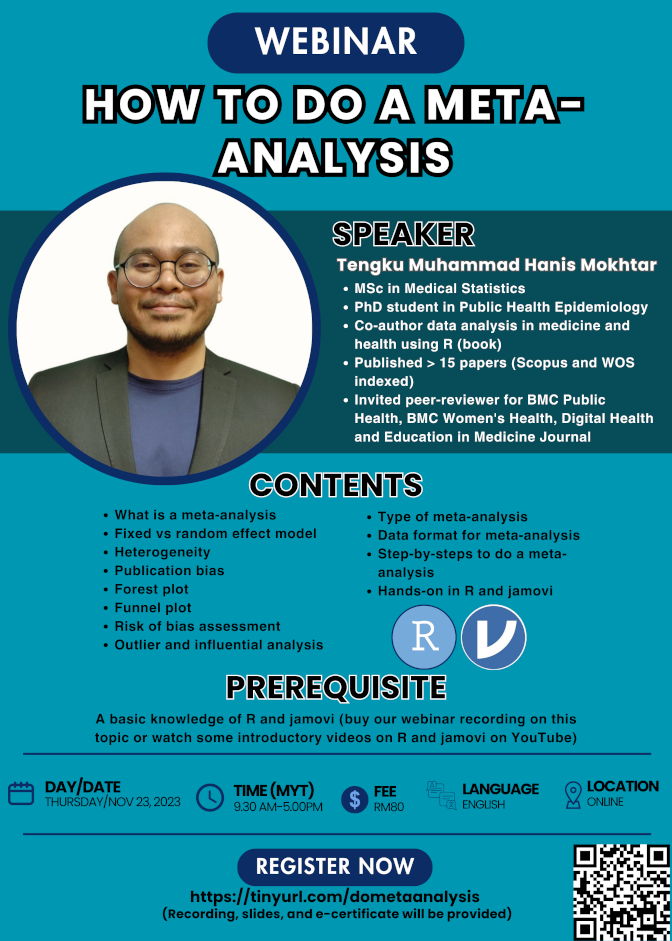

Meta-analysis is a quantitative analysis, aims to combine the result of previous scientific studies. This webinar covered step-by-step how to do a meta-analysis in R and jamovi. The slides and recording of the webinar is available for purchase at [Jom Research](https://tinyurl.com/jomresearchlinks?fbclid=IwZXh0bgNhZW0CMTAAAR03m6xQOpINtpXgMU8wRzYSRBEGcP3lgdqG7ez-OlDeac616GEH6nV6iVc_aem_QZWpvfqNmF4dzUD2r0-6PA).

-   Date: Nov 23, 2023 9:30 AM — 5:00 PM
-   Location: Virtual (Google Meet)
