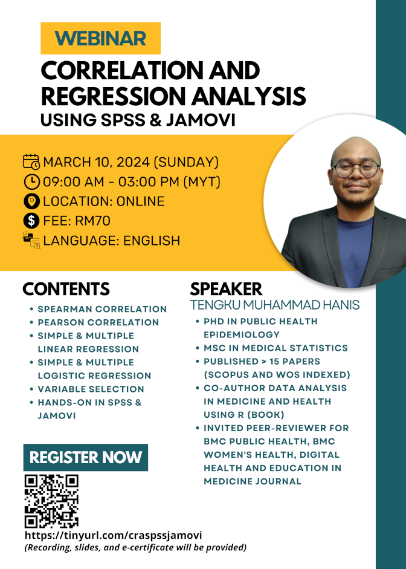

This webinar covered step-by-step how to do a correlation and regression analysis using SPSS and jamovi. The slides and recording of the webinar is available for purchase at [Jom Research](https://docs.google.com/presentation/d/e/2PACX-1vQDF13uTluqPsmTKJEtpRXz2k6REfWApXllmqR6hRouA8GDH6EJgFew1liP7Q2lUeMN_IOMU0CXZ3FA/pub?start=false&loop=false&delayms=3000&fbclid=IwZXh0bgNhZW0CMTAAAR03m6xQOpINtpXgMU8wRzYSRBEGcP3lgdqG7ez-OlDeac616GEH6nV6iVc_aem_QZWpvfqNmF4dzUD2r0-6PA&slide=id.g3301cdfe24b_0_6).

-   Date: Mar 10, 2024 9:00 AM — 3:00 PM
-   Location: Virtual (Google Meet)
