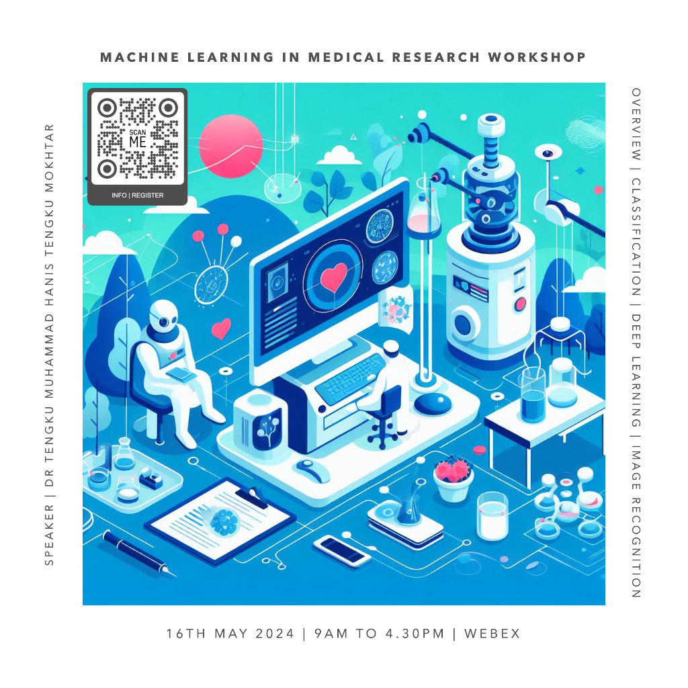

This virtual workshop covered an introduction to machine learning and deep learning in medical research. The participants were exposed to practical application of the subjects in R. The first half of the workshop covered the theory and hands-on of machine learning, while the second half covered the deep neural network (DNN) and convolutional neural network (CNN).

-   Date: May 16, 2024 9:00 AM — 4:30 PM
-   Location: Virtual (Webex)
