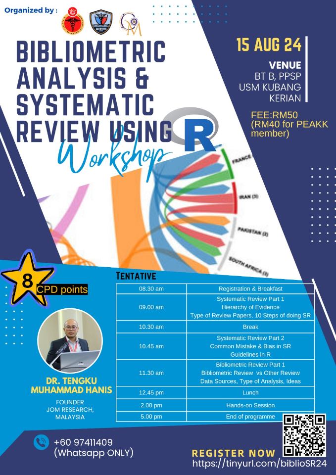

This workshop provided a comprehensive, step-by-step guide to conduct a systematic review, equipping participants with the essential skills to gather, analyze, and synthesize research findings. Additionally, the workshop introduced participants to bibliometric reviews, where they gained hands-on experience in performing bibliometric analysis using R and the biblioshiny interface. By the end of the session, attendees were proficient in leveraging these tools to enhance the rigor and impact of their research.

-   Date: Aug 15, 2024 8:30 AM — 5:00 PM
-   Location: Bilik Tutorial B, School of Medical Sciences, Universiti Sains Malaysia
