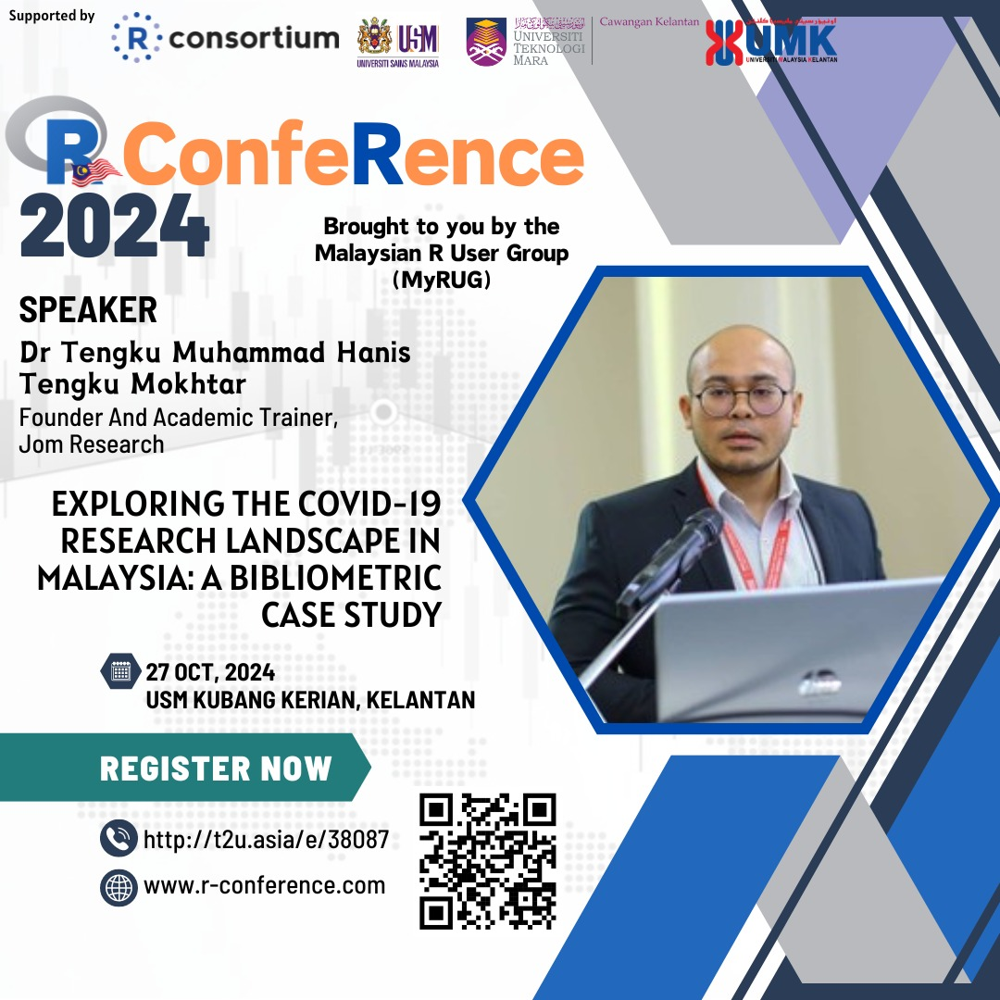

This talk presented a bibliometric analysis of Malaysia's COVID-19-related research, using data from the Web of Science database. The bibliometric analysis, which quantitatively evaluated publications through metrics like citation counts, publication volume, and collaboration networks, provided insights into key research trends, influential contributors, and collaborative efforts. By employing R and Python for the analysis, this case study demonstrated how bibliometric techniques could uncover valuable patterns and trends within Malaysia's pandemic research landscape.

-   Date: Oct 27, 2024 11:30 AM — 12:00 PM
-   Event: Malaysia's R confeRence 2024
-   Location: Dewan Kualiah 4, School of Medical Sciences, Universiti Sains Malaysia
-   Link:
    -   [ Slides](https://tengku-hanis.github.io/bibliocovidmalaysia/#1)
