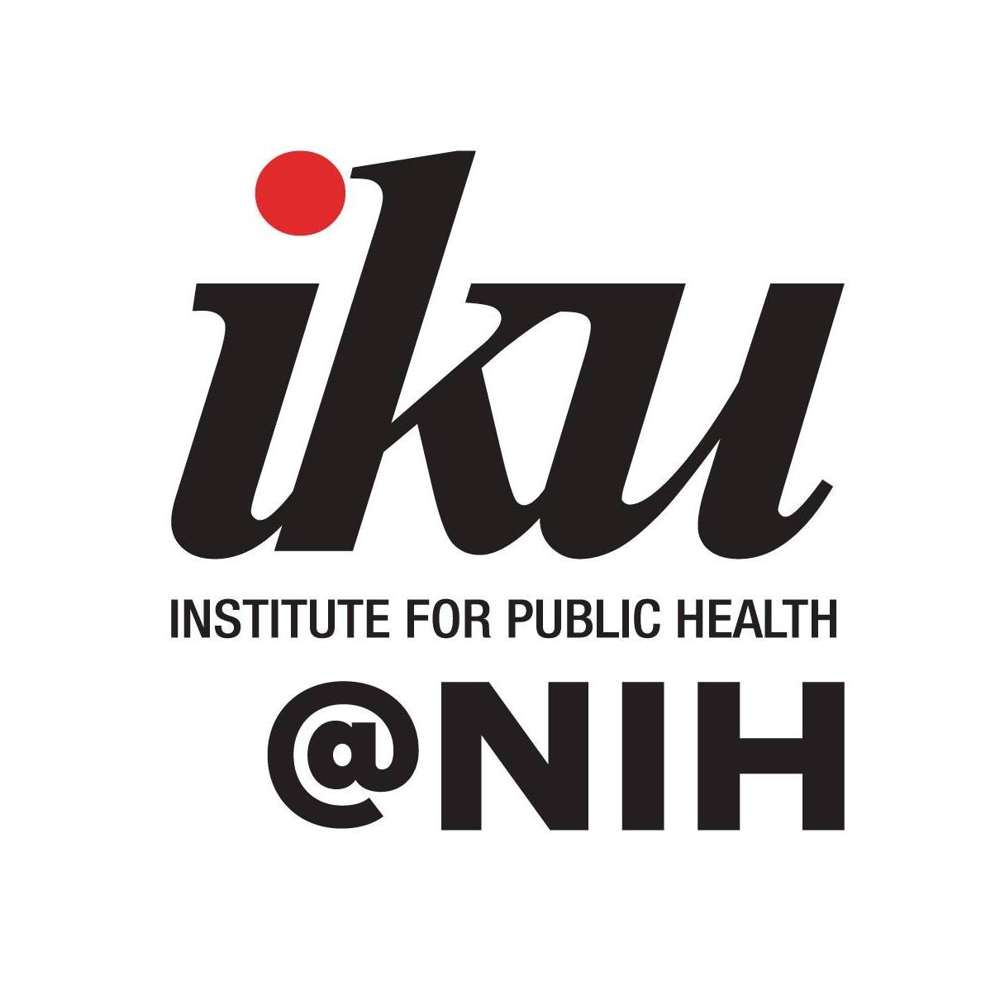

{width="60%"}

This workshop introduced participants to the fundamental concepts of machine learning and deep learning, covering key algorithms and their applications. Participants were also guided through practical exercises using R, with a focus on data manipulation, visualization, and implementing basic machine learning models. By the end of the workshop, attendees were equipped with the skills to utilize R for analyzing datasets, building predictive models, and applying deep learning techniques, fostering a deeper understanding of how machine learning and R can be used in real-world problem-solving.

-   Date: Oct 22, 2024 8:30 AM — Oct 23, 2024 5:00 PM
-   Location: Makmal Komputer 3 ( D2-L5-20 ) , Aras 5, Blok D2, NIH, Setia Alam, Selangor
