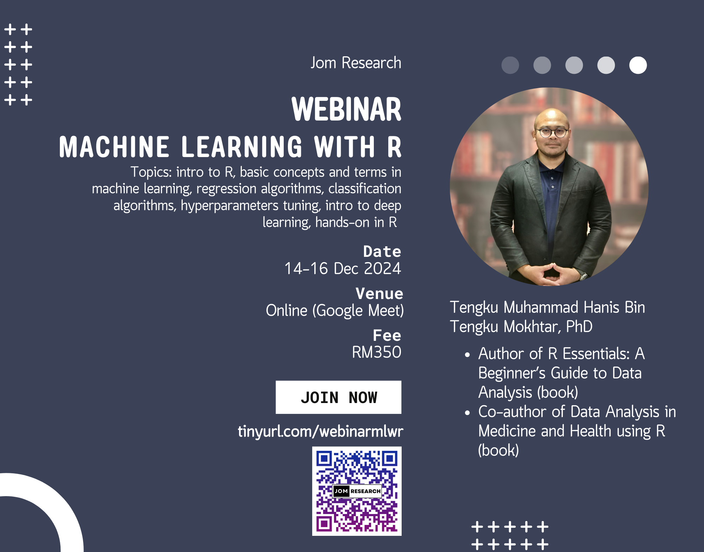

{width="70%"}

This webinar covered an introduction to R and machine learning, including topics such as regression and classification algorithms, hyperparameter tuning, ensemble methods, explainable machine learning, and an introduction to deep learning. In the hands-on session, participants learned how to implement a machine learning model in R. The slides and recording of the webinar are available for purchase at [Jom Research](https://docs.google.com/presentation/d/e/2PACX-1vQDF13uTluqPsmTKJEtpRXz2k6REfWApXllmqR6hRouA8GDH6EJgFew1liP7Q2lUeMN_IOMU0CXZ3FA/pub?start=false&loop=false&delayms=3000&fbclid=IwZXh0bgNhZW0CMTAAAR03m6xQOpINtpXgMU8wRzYSRBEGcP3lgdqG7ez-OlDeac616GEH6nV6iVc_aem_QZWpvfqNmF4dzUD2r0-6PA&slide=id.g3301cdfe24b_0_6).

-   Date: Dec 14, 2024 9:30 AM — Dec 16, 2024 4:30 PM
-   Location: Virtual (Google Meet)
