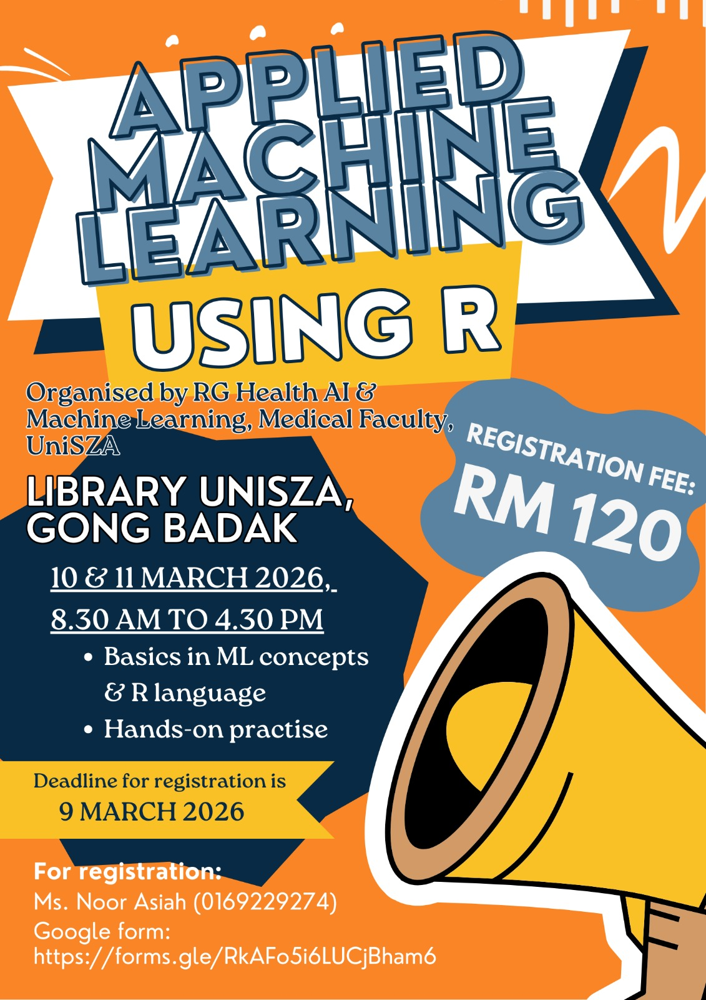

{width="70%"}

This workshop introduced participants to the fundamental concepts of machine learning and deep learning, covering key algorithms and their applications. Participants were also guided through practical exercises using R, with a focus on data manipulation, visualization, and implementing basic machine learning models. By the end of the workshop, attendees were equipped with the skills to utilise R for analysing datasets and building predictive models, thus, solidifying a deeper understanding of how machine learning and R can be used in real-world problem-solving.

-   Date: March 10, 2026 8:30 AM — March 11, 2026 4:30 PM
-   Location: Smart Classroom, UniSZA Library
-   Link:
    -   [ Slides](https://github.com/tengku-hanis/ml_rg_unisza/tree/main/Slides)
    -   [ Data and codes](https://github.com/tengku-hanis/ml_rg_unisza)
