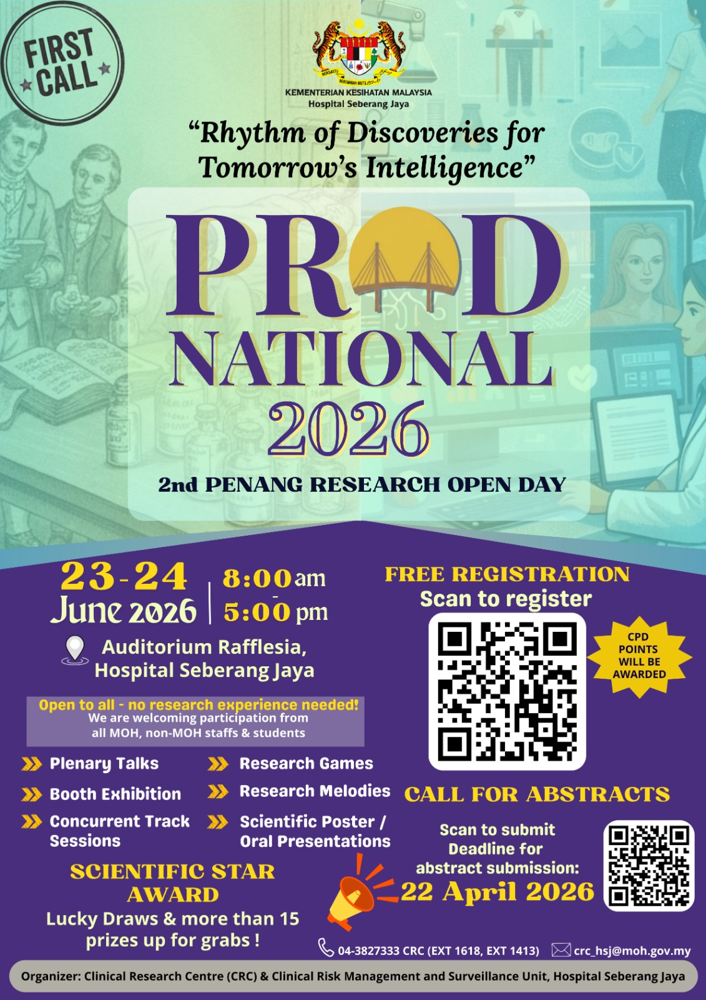

{width="70%"}

As AI continues to transform digital health, building reproducible predictive models is an essential skill for healthcare data professionals. This hands-on workshop introduces tidymodels, a framework for machine learning in R. By leveraging a consistent, human-readable syntax, the tidymodels ecosystem simplifies complex machine learning tasks, allowing practitioners to focus on the clinical problems at hand rather than fighting with code. This workshop will introduce participants to the basics of machine learning through tidymodels and R.

-   Date: June 24, 2026 11:35 AM — 12:50 PM
-   Location: Makmal Iris, Hospital Seberang Jaya
-   Link:
    -   [ Slides](https://github.com/tengku-hanis/prod2026/blob/main/Slide.pdf)
    -   [ Data and codes](https://github.com/tengku-hanis/prod2026)
