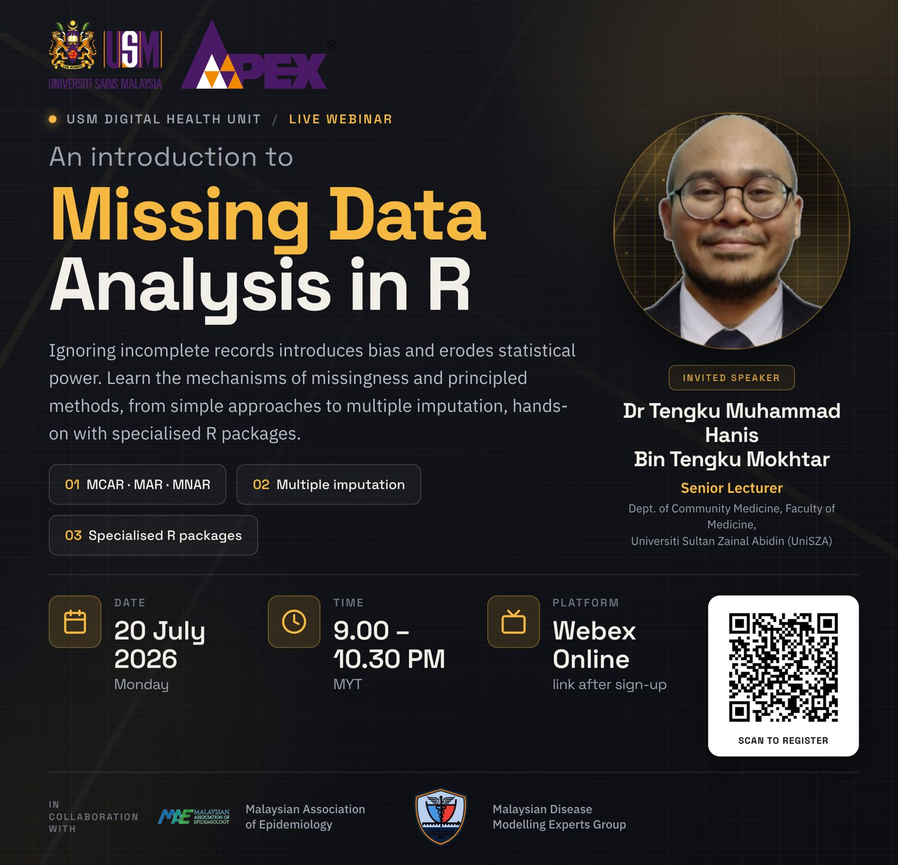

{width="70%"}

Missing data is an unavoidable reality in research, and ignoring incomplete records can introduce serious bias and erode statistical power. This 1.5-hour webinar introduces the core mechanisms of missing data and the practical techniques used to analyse incomplete datasets, from simple approaches to principled methods such as multiple imputation. The session included clinicians, researchers, and data managers who want to handle missingness rigorously rather than dropping cases by default.

-   Date: July 21, 2026 09:00 PM — 10:30 PM
-   Location: Online
-   Link:
    -   [ Slides](https://github.com/tengku-hanis/missingdata_mae/blob/main/Missing%20data%20in%20R.pdf)
    -   [ Data and codes](https://github.com/tengku-hanis/missingdata_mae)
