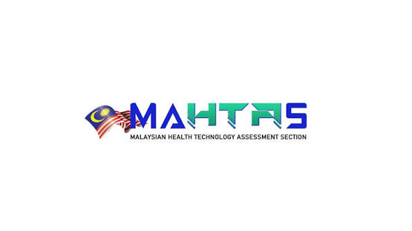

{width="70%"}

This 2-day MAHTAS workshop aimed to strengthen participants’ understanding of inferential statistics and introduce them to the R software. The programme covered the basic concepts of inferential statistics before progressing to selected basic and intermediate statistical analyses, including parametric and non-parametric tests, correlation analysis, regression analysis, and categorical data analysis. Participants also learned how to interpret statistical results and assess the assumptions underlying each method. In addition, the workshop included sessions on critical appraisal of scientific papers, where participants discussed the methods and results of a published study in groups. By the end of the workshop, participants were expected to have improved their understanding of common statistical analyses, gained introductory exposure to R software, and enhanced their ability to evaluate research findings more critically.

-   Date: July 22, 2026 — July 23, 2026
-   Location: Kompleks Setia Perdana, Jabatan Perdana Menteri, Putrajaya
-   Link: [ Material](https://github.com/tengku-hanis/missingdata_mae/blob/main/Missing%20data%20in%20R.pdf)
  